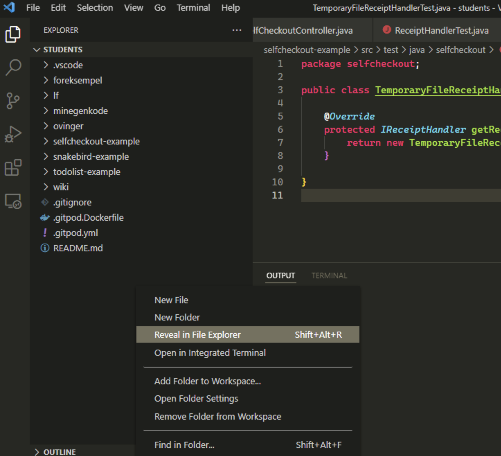
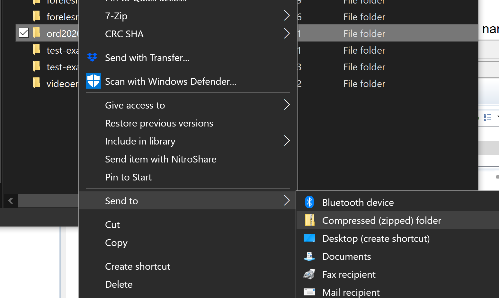

# Exam Spring 2022

- **Denne filen på [Bokmål](README.md)**
- **Denne fila på [nynorsk](README_nn.md)**

This exam consists of the following parts, contained within separate packages:

- [Del 1](src/main/java/part1/part1_en.md)
- [Del 2](src/main/java/part2/part2_en.md) 
- [Del 3](src/main/java/part3/part3_en.md) 
- [Del 4](src/main/java/part4/part4_en.md) 
- [Del 5](src/main/java/part5/part5_en.md)

## Organization

The descriptions of the exam questions/problems/tasks you will find in each part, in a markdown file. For example, the description of part 1 will be in src/main/java/part1/part1_en.md. For convenience, there is a link to it above. 

Read the description of each part carefully. There will often be extra information in the javadoc in the class files. You can also navigate to the class file where you write your solutions, from the markdown files.

If you find that there is things that are unclear, or that there are inconsistencies in the problem description, make assumptions that you find the most meaningful, and make a note of it in [oppgavekommentarer](oppgavekommentarer.md).

If you cannot solve or implement some part of a problem, you may assume in further work that you have a working solution to this part. 

You should still have a compiling solution. If necessary, supply dummy return values, that have the correct type, but are not necessarily correct.

Non-compiling code will give reduced marks.

Exceptions like NullPointerException, are not compilation problems, but will not give full marks. 
Test your code so that you know it runs. For this, most of the classes have a static main method that contains some code to test your implementation. These are just simple tests, so we urge you to do your own testing. This should also compile, and you do not need to remove these when you hand in your exam.

## Navigation

The problem description contains links to the files where you write your code. When you have opened a .md (markdown) file, you can pushn **Preview**-icon to get a more readable view.

All methods you are to implement are marked with //TODO.
In VSCode, you can get an overview of all occurrences with Ctrl + Shift + F (search whole open directory)

## Answering the questions

The exam is answered by building on the existing code in the exam folder, filling in code according to the problem descriptions. Fill also in any assumption you make, or other comments that you think are important for understanding your solution, in the comments file [oppgavekommentarer](oppgavekommentarer.md).

## Getting the exam 
See information in Inspera. 

## Delivery
When delivering the exam, do the following:

## Delivering from VSCode
You need to zip the correct folder. You can get this folder from this procedure:

**Zip-ing i Windows**
- Right click in an empty area in 'Explorer' in the left pane. That will be below the last file in the outermost folder.
- Choose *Reveal in File Explorer* in the selection menu.
- You will now get an Explorer window (not VSCode, but in Winodws). Here the folder we want to compress be already selected/highlighted, but check that it is the correct folder.
- Right click the folder (called **exam** if you did not change its name)
- Select 'Send to' -> 'Compressed (zipped) folder'
- Windows will now compress the folder, asking for you to name it. Leave the name as suggested (exam.zip)
- This is the zip-file you upload to Inspera.
- There is some images below illustrating this.

**Zip-ing in macOS**

- Follow the instructions as for Windows above, but things are called by other names.
- Right click an empty area in the **Explore** pane to the left, and choose *'Reveal in Finder'*
- Right click the folder that now is marked in the Finder window, and choose *'Compress'*
- The file you now get, is the one to upload to Inspera.

**System Explorer in VSCode**

**System Explorer in Eclipse**

**Compressing / zip**

