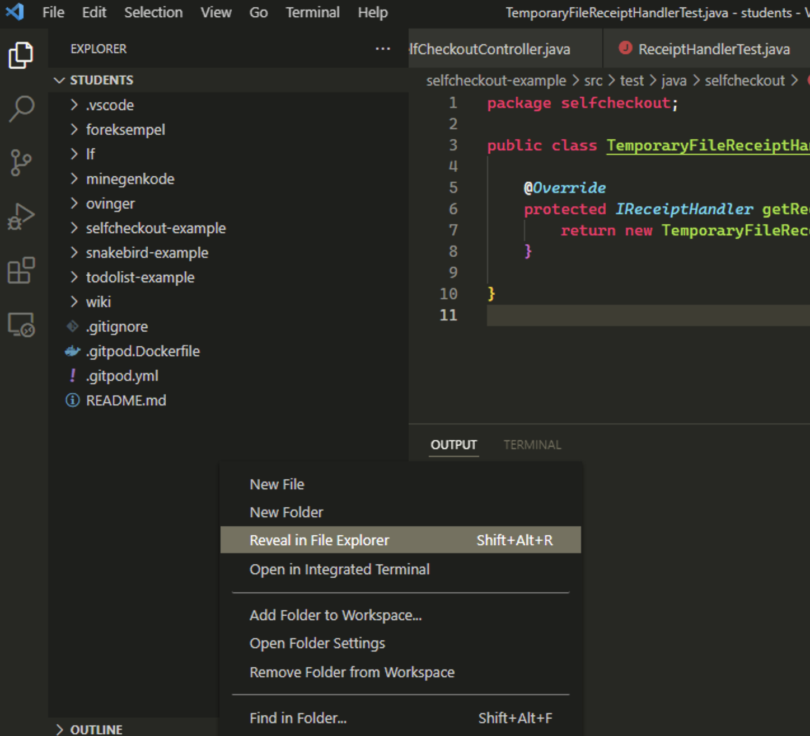

# Eksamen Vår 2022

- *This file in [English](README_en.md)*
- *Denne filen på [bokmål](README.md)*

Oppgåva består av følgjande delar, som ligg inne i kvar sin pakke.

- [Del 1](src/main/java/part1/part1_nn.md)
- [Del 2](src/main/java/part2/part2_nn.md) 
- [Del 3](src/main/java/part3/part3_nn.md) 
- [Del 4](src/main/java/part4/part4_nn.md) 
- [Del 5](src/main/java/part5/part5_nn.md) 

## Oppgåveformat

Oppgavebeskrivelsene finn de under kvar del. Det vil seia src/main/java/part1/part1.md inneheld oppgåveskildringa for del 1.
Oppgåvene har ei tekstskildring, les denne! Ytterlegare informasjon kan stå i javadoc-en, som er kommentarar som står før klassedeklarasjonen og metodane i kjeldekoden.
De kan bruka .md-filene til å navigera til riktige filer/klassar som faktisk skal implementerast.
Dersom du meiner at javadoc og oppgåveskildring inneheld motstridande informasjon, så gjer ein kommentar om dette i [oppgåvekommentarar](oppgåvekommentarar.md) og
utfør oppgåva slik du meiner gir best meining. 

Viss du ikkje skulle klara å implementera ein metode i ein del kan du sjølvsagt bruka denne vidare som om han verka (som i tidlegare 'papireksamenar').
Merk at metoden bør framleis kompilera, alle metodar kompilerer ved hjelp av *dummy* return verdiar, som er verdiar av riktig type, men ikkje korrekte.

Kode som ikkje kompilerer vil gi trekk.

Unntak i koden som NullPointerException er ikkje kompileringsproblemer (men vil sjølvsagt ikkje gi full poengsum). De bør testa dykkar eigen kode slik at de veit at denne køyrer. For å hjelpa med dette har dei fleste delar main-metode som inneheld noko kode for å testa implementeringen. Desse main-metodene testar ikkje nødvendigvis alle tilfelle så du blir oppfordra til å utvida med dine eigne testar. Denne koden bør framleis kompilera, men treng ikkje fjernast ved levering. 

## Navigering

Oppgavebeskrivelsene kan brukast som hjelp til å navigera til riktige filer. Når du har ope ein .md-fil kan du trykka på **Preview*-ikon for å få dette på ein meir leselig måta. 

Alle metodane de skal fylla inn er og markerte med // TODO.
Desse kan du få ei oversyn over i VSCode med Ctrl + Shift + F (søk i heile opne mappe)

## Besvarelse

Oppgaveteksten finnast i  **partx.md*-filer og andre md-filer i prosjektet og kan lesast både på gitlab og i IDE-en. Versjonar på nynorsk og engelsk finst i eigne filer. 

Oppgåva blir svart på* ved å bygga vidare på kode-filene som er der, og fylla inn evt antakelser du gjer, i ein separat md-fil (oppgåvekommentarar.md)

Import med kloning skjer med ein annan vegvisar, som  beskrive på følgjande wiki-side:  <https://www.ntnu.no/wiki/display/tdt4100/Importere+kode+fra+git>. Lenka ein då kan klona er *https://gitlab.stud.idi.ntnu.no/tdt4100/v2022/ord-2022*. 

Dersom det blir konfliktar når de pullar kan de høyreklikke og *Replace with > Head Revision * på prosjektet. 

## Levering
Når eksamen skal leverast kan du gjera dette på denne måten:

**Zippe i Windows**

- Høgreklikk på eit *tomt område** i 'Explorer' heilt til venstre i VSCode. Dette vil vera under 'nedste' fil i ytste mappe.
- Vel *'Reveal in File Explorer'** frå nedtrekkmenyen som dukkar opp.
- Du skal no få opp eit utforskervindu (ikkje i VSCode, men i Windows). Her skal mappa som inneheld prosjektfolderen vi skal komprimera allereie vera markerte, men dobbeltsjekk at dette stemmer.
- Høgreklikk på prosjektmappa (ho skal heita **exam** eller tilsvarande viss du har endra namn)
- Vel *'Send til' -> 'Komprimert (zippet) mappe'**.
- Windows komprimerer no prosjektmappa **exam**, og spør deg kva den skal kallast. La den heite det som blir foreslått.
- Denne zipfilen er fila de skal lasta opp til Inspera til slutt.
- De finn eit par bilde av prosessen til slutt i denne fila.

**Zippe i macOS (OS X)**

- Følg instruksjonane som for Windows overfor, men ting har andre namn.
- Høgreklikk på eit tomt område i **Explorer** heilt til venstre i VSCode og vel *'Reveal in Finder'*
- Høgreklikk prosjektmappa som no skal vera markert og vel *'Komprimer'**.
- Fila du får er den som skal lastast opp til Inspera.

Vêr nøye med at du vel riktig mappe!

### For Eclipse
**Zippe i Windows*

- Høgreklikk på prosjektikonet i 'Package Explorer' heilt til venstre i Eclipse.
- Vel 'Show in' -> click 'System Explorer'.
- Du skal no få opp eit utforskervindu (ikkje i Eclipse, men i Windows) som står ope i ein foldar som sannsynlegvis sluttar på git. For meg er det _'C:\Users\borgeha\git'_ Denne folderen inneheld prosjektfolderen vi skal komprimera.
- Høgreklikk prosjektfolderen, han skal heita kont2021 -> meny 'Send til' -> 'Komprimert (zippet) mappe'. 
- Windows komprimerer no prosjektfolderen kont2021, og spør deg kva han skal kallast La den heite det som blir foreslått.
- Denne zipfilen er fila de skal lasta opp til Inspera til slutt.
- De finn eit par bilde av prosessen til slutt i denne fila.

**Zippe i OS X*

- Følg instruksjonane som for Windows overfor, men ting har andre namn.
- Høgreklikk prosjektet i Eclipse -> 'Åpne i Finder'
- Høgreklikk prosjektfolderen og vel 'Komprimer'
- Fila du får er den som skal lastast opp til Inspera.

**System Explorer i VSCode**

**System Explorer i Eclipse**

**Komprimering av eksamensbesvarelse**

