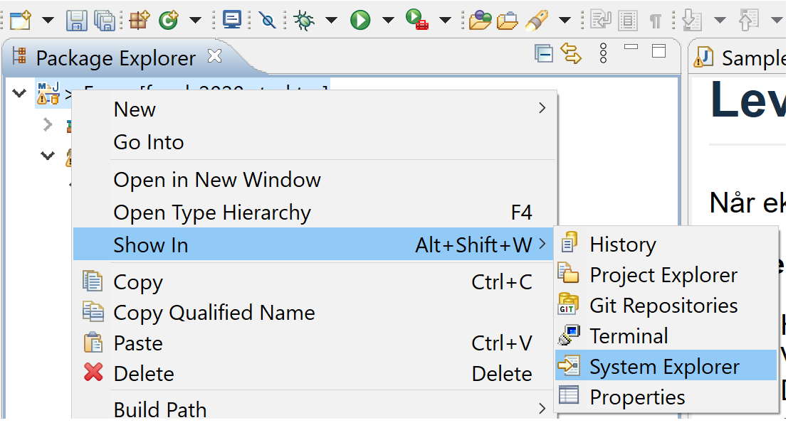

# Eksamen Vår 2022

Oppgaven består av følgende deler, som ligger inne i hver sin java-**pakke** (undermapper under **src/main/java**). Noen deler kan ha samme pakke hvis de benytter seg av samme klasser.

- Del X

## Oppgaveformat

Oppgavebeskrivelsene finner dere under hver del. Det vil si at **src/main/java/del1/del1.md** inneholder oppgavebeskrivelsen for del 1, og så videre.

Oppgavene har en tekstbeskrivelse, men denne er ikke alltid utfyllende. De mest utfyllende kravene til en metode står i dens javadoc-beskrivelse, altså en kommentar som står før metoden selv i kildekoden. I utgangspunktet trenger dere kunne å bruke .md-filene for å navigere til riktige klasser som faktisk skal implementeres, alt av krav til metoder står i selve Java-docen. Det er likevel i mange oppgaver spesifisert hvilke metoder som skal implementeres, og hva disse skal gjøre, men dette står da og i Java-docen, og kun Java-docen inneholder informasjon om f.eks Exceptions som skal utløses. Dersom du mener at Java-docs og oppgavebeskrivelse inneholder motstridende informasjon, ta først og fremst hensyn til det som står i Java-docen.  

Et web-view av Java-docen kan og bli sett ved å åpne filen doc/index.html prosjektet.

Hvis du ikke skulle klare å implementere en metode i en del kan du selvfølgelig bruke denne videre som om den virket (som i tidligere 'papireksamener'). Merk at metoden bør fortsatt kompilere. Dette kan oppnås ved å legge inn såkalte **dummy**-returverdier som er verdier av riktig **type** som alltid returnerer det samme, men som da ikke er den korrekte returverdien for det enkelte tilfellet som testes. Et eksempel på en metode hvor man har gjort dette kan sees nedenfor:

```java
public int calculcateNumber(double param) {
    // Noe uferdig kode her...
    return 0; // dummy-verdi
}
```

Kræsj i koden, som **NullPointerException** og lignende, samt kode som ikke kompilerer vil fortsatt bli vurdert, men vil selvfølgelig ikke gi full poengsum. Dere bør teste deres egen kode slik at dere vet at denne kjører. For å hjelpe med dette har de fleste deler en main-metode som inneholder noe kode for å teste implementeringen. Disse main-metodene er ikke dekkende og tester ikke alle tilfeller (i motsetning til hva man kanskje er vant med på øvingsopplegget) så du oppfordres til å utvide med egne tester. Denne koden bør fortsatt kompilere, men trenger ikke fjernes ved levering.

## Navigering

Oppgavebeskrivelsene kan brukes som hjelp til å navigere til riktige filer. Når du har åpent en **.md**-fil kan du trykke på følgende ikon oppe i høyre hjørne for å få dette i split-view på høyre side og på en mer leselig måte:


Alle metodene dere skal fylle inn er og markert med `//TODO` inne i selve Java-filene.

## Besvarelse

*Oppgaveteksten* finnes i **delX.md**-filer og andre md-filer i prosjektet og kan leses både på gitlab og i IDE-en. Versjoner på nynorsk og engelsk finnes i egne filer.

Oppgaven *besvares* ved å bygge videre på kode-filene som er der, og fylle inn evt antakelser du gjør, i en separat md-fil (**oppgavekommentarer.md**)

## Nedlasting og import

*Nedlasting* og *import* skjer enten ved å laste ned en zip-fil fra repository-siden på gitlab eller Inspera, eller ved å klone git-repoet. Fremgangsmåten avhenger av hvilken IDE du bruker:

### Import i VSCode

Ved *import av zip-fil* så trykker du på **File -> Open Folder ...**. Naviger deretter til den nedlastede zip-filen (husk og åpne zip-filen først) og velg mappen som gjør at pom.xml filen ligger inne i denne. Ved import av zip-fil bør du og bytte navn på prosjektet hvis du laster det ned på forhånd, så du ikke får konflikt med navngivning når du skal laste ned selve eksamen.

*Import med kloning* skjer med en annen veiviser, som  beskrevet på følgende wiki-side: <https://www.ntnu.no/wiki/pages/viewpage.action?pageId=234489370>. Lenken en da kan bruke til å klone er *<https://gitlab.stud.idi.ntnu.no/tdt4100/v2022/exam>*.

Dersom det blir konflikter når dere puller kan du åpne et terminalvindu inne i VSCode-vinduet ditt og skrive kommandoen `git stash`.

### Import i Eclipse

Ved *import av zip-fil*, så skal veiviseren **Import > Maven > Existing Maven Projects** brukes. Naviger til den nedlastede zip-filen (husk og åpne zip-filen først) og velg mappen som gjør at pom.xml filen ligger inne i denne. Ved import av zip-fil bør du og bytte navn på prosjektet hvis du laster det ned på forhånd, så du ikke får konflikt med navngivning når du skal laste ned selve eksamen.

*Import med kloning* skjer med en annen veiviser, som  beskrevet på følgende wiki-side:  <https://www.ntnu.no/wiki/display/tdt4100/Importere+kode+fra+git>. Lenken en da kan bruke til å klone er *<https://gitlab.stud.idi.ntnu.no/tdt4100/v2022/exam>*.

Dersom det blir konflikter når dere puller kan dere høyreklikke og *Replace with > Head Revision* på prosjektet.

## Levering

Når eksamen skal leveres kan du gjøre dette på denne måten, avhengig av hvilken IDE du bruker:

### Levering i VSCode

**Zippe i Windows**

- Høyreklikk på et **tomt område** i 'Explorer' helt til venstre i VSCode. Dette vil være under 'nederste' fil i ytterste mappe.
- Velg **'Reveal in File Explorer'** fra nedtrekksmenyen som dukker opp.
- Du skal nå få opp et utforskervindu (ikke i VSCode, men i Windows). Her skal mappen som inneholder prosjektfolderen vi skal komprimere allerede være markert, men dobbeltsjekk at dette stemmer.
- Høyreklikk på prosjektmappen (den skal hete **exam** eller tilsvarende hvis du har endret navn)
- Velg **'Send til' -> 'Komprimert (zippet) mappe'**.
- Windows komprimerer nå prosjektmappen **exam**, og spør deg hva den skal kalles. La den hete det som foreslås.
- Denne zipfilen er filen dere skal laste opp til Inspera til slutt.
- Dere finner et par bilder av prosessen til slutt i denne filen.

**Zippe i macOS (OS X)**

- Følg instruksjonene som for Windows overfor, men ting har andre navn.
- Høyreklikk på et tomt område i **Explorer** helt til venstre i VSCode og velg **'Reveal in Finder'**
- Høyreklikk prosjektmappen som nå skal være markert og velg **'Komprimer'**.
- Filen du får er den som skal lastes opp til Inspera.

### Levering i Eclipse

**Zippe i Windows**

- Høyreklikk på prosjektikonet i 'Package Explorer' helt til venstre i Eclipse.
- Velg **'Show in' -> click 'System Explorer'**.
- Du skal nå få opp et utforskervindu (ikke i Eclipse, men i Windows) som står åpent i en mappe som skal inneholder prosjektfolderen vi skal komprimere.
- Høyreklikk prosjektfolderen (den skal hete **exam**)
- Velg meny **'Send til' -> 'Komprimert (zippet) mappe'**.
- Windows komprimerer nå prosjektfolderen **exam**, og spør deg hva den skal kalles La den hete det som foreslås.
- Denne zipfilen er filen dere skal laste opp til Inspera til slutt.
- Dere finner et par bilder av prosessen til slutt i denne filen.

**Zippe i macOS (OS X)**

- Følg instruksjonene som for Windows overfor, men ting har andre navn.
- Høyreklikk prosjektet i Eclipse -> **'Åpne i Finder'**
- Høyreklikk prosjektmapen og velg **'Komprimer'**.
- Filen du får er den som skal lastes opp til Inspera.

**System Explorer i VSCode**


**System Explorer i Eclipse**



**Komprimering av eksamensbesvarelse**


