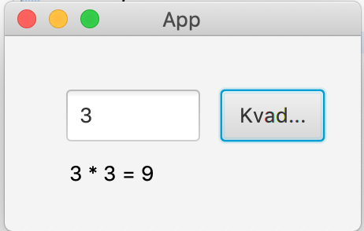
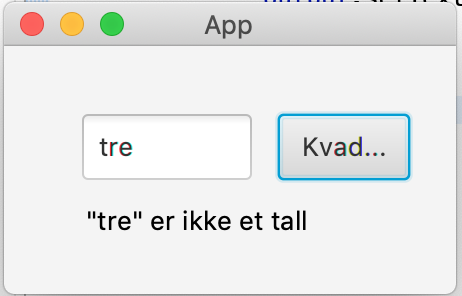

## FXML App

This quite simple application has one purpose - square a number that is entered,
and show the square number in the appropriate text field.

There are some issues with the code - find them and fix them!

> **For those using IntelliJ IDE:** To be able to execute the code in this part, you must create a path under `src/main/` named `resources/part5` and move `App.fxml` into this folder. The path to the file should therefore be `src/main/resources/part5/App.fxml` Please note that there are more mistakes in the code that makes the code crash.

Note: "er ikke et tall", means "is not a number".
