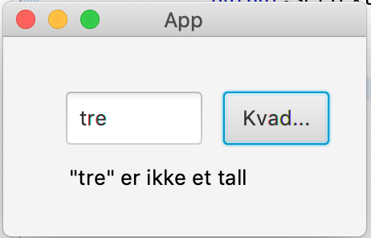

## FXML App (15%)

Denne applikasjonen har ett formål - å vise kvadratet av tallet som skrives inn.

Det er noen utfordringer med koden - finn dem og fiks dem!

> **NB! Kun for deg som bruker IntelliJ som IDE:** For å kunne kjøre koden i denne oppgaven må du opprette en sti under `src/main/` som heter `resources/part5` og flytte `App.fxml` over i denne mappen. Stien til filen skal altså være `src/main/resources/part5/App.fxml` Merk at det er flere feil i koden som gjør at den ikke kjører.

